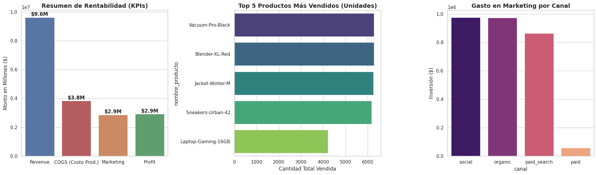
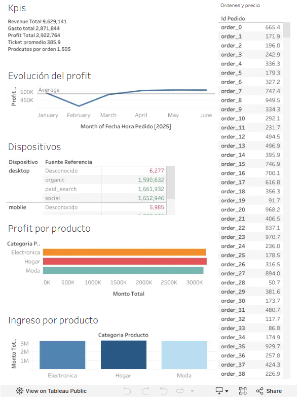

# Análisis de rentabilidad y retención — App de delivery

Proyecto de análisis de datos end-to-end sobre el desempeño de una plataforma de delivery: rentabilidad, embudo de conversión, retención de usuarios y un experimento A/B, cerrando con un dashboard ejecutivo en Tableau.

## Contexto

Evaluación del desempeño de una app de delivery para apoyar decisiones de negocio basadas en datos, combinando pedidos, catálogo, marketing y comportamiento de usuario.

## Herramientas

Python (pandas, NumPy), SQL, pruebas de hipótesis estadísticas (Z-test), Tableau

## Preguntas clave

- ¿Es rentable el negocio y qué tan sano es el margen?
- ¿En qué etapa del embudo se pierden más usuarios?
- ¿Regresan los usuarios después de registrarse?
- ¿La nueva UI del checkout mejora la conversión?

## Metodología

Limpieza y validación de datos → cálculo de KPIs de rentabilidad → construcción del funnel de conversión con SQL → análisis de retención por cohortes → prueba Z de proporciones para el experimento A/B → dashboard ejecutivo en Tableau.

## Conclusiones

- El negocio es rentable, con un margen cercano al 30% (~$2.9M USD de profit sobre $9.6M de revenue).
- El mayor cuello de botella del funnel está en el paso de pago (`add_payment_info`), con caída a 86.7% de conversión; la conversión total del embudo es de 80%.
- El cambio de UI en el checkout no generó una mejora estadísticamente significativa (p = 0.42).

## Recomendaciones

- Auditar la captura de datos para bloquear valores atípicos desde el origen.
- Reasignar presupuesto de marketing hacia canales orgánicos/eficientes.
- Investigar causas funcionales (no solo estéticas) de la caída en el checkout.
- Activar campañas de re-engagement para usuarios inactivos en su primera semana.

## Visualizaciones destacadas

🔗 [Ver dashboard interactivo en Tableau Public](https://public.tableau.com/app/profile/hernando.zamora/viz/Entrega2_17873387898950/Dashboard1?publish=yes)

## Notebook completo

📓 [Ver notebook del análisis completo](analysis_deliveries.ipynb)
